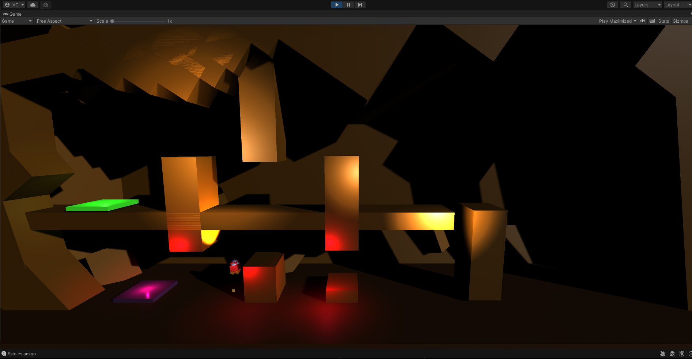

<h1>Boost minigame</h1>

A classic mini-game developed during the GameDev course. 
This project was created for learning purposes.

If you wanna test it you can play it.
<h2>Controls</h2>
Move: a-d. 
Boost: space. 
<h2>Objective</h2>
Complete all levels

<h2>Image</h2>

